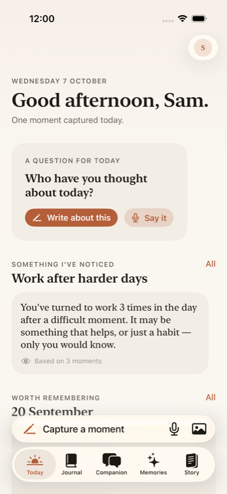
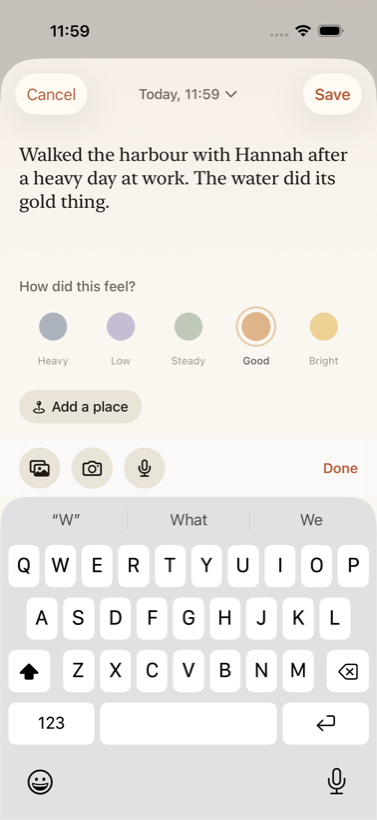
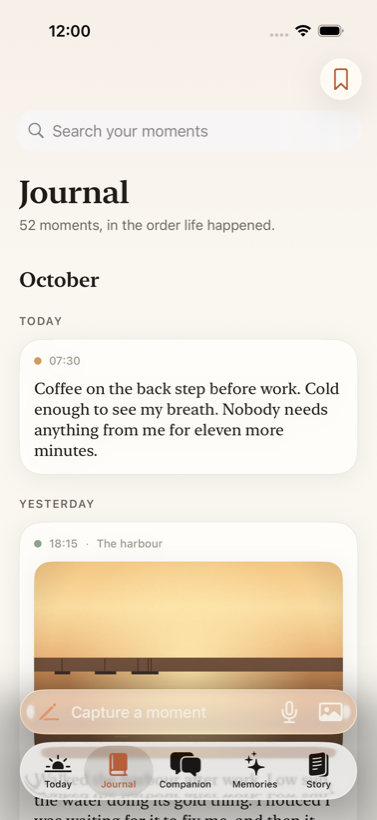
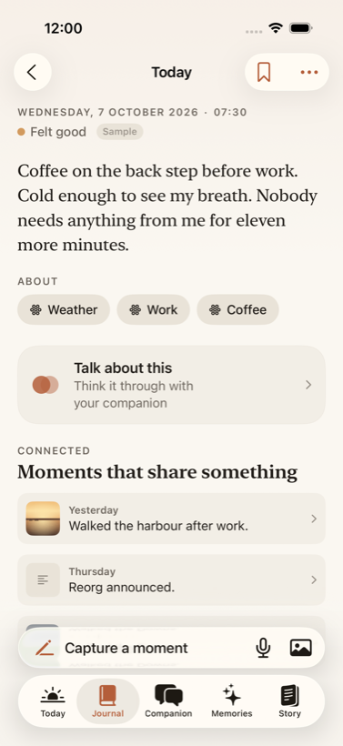
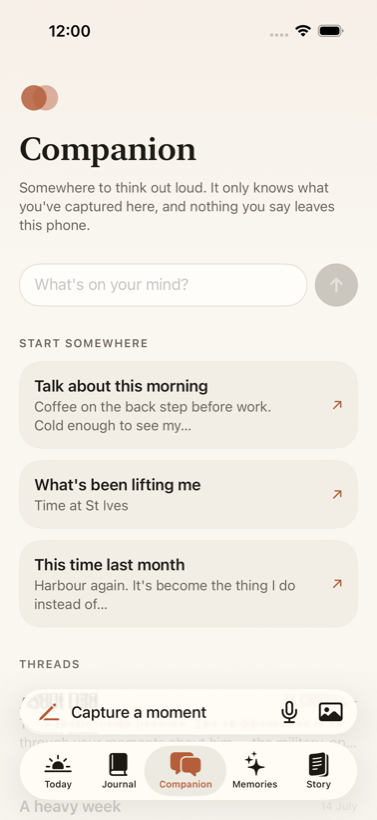
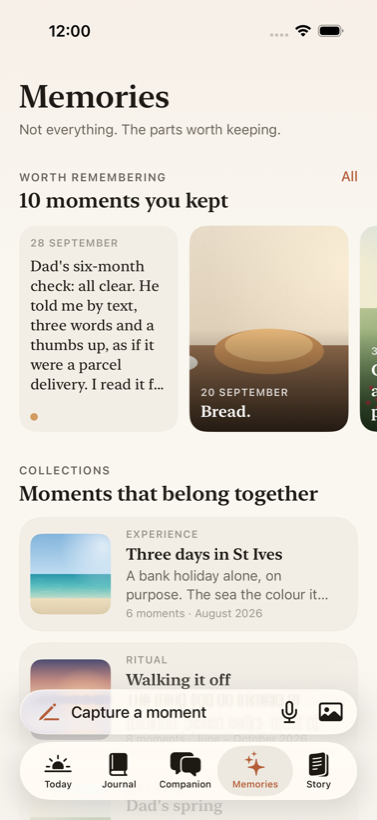
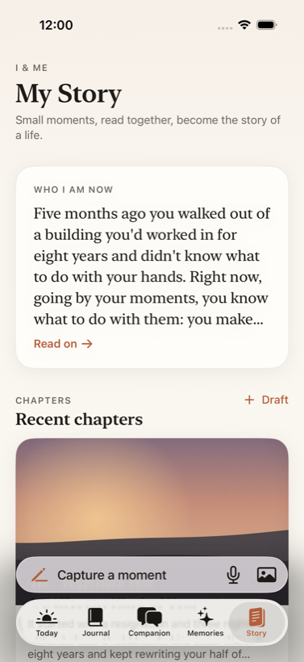
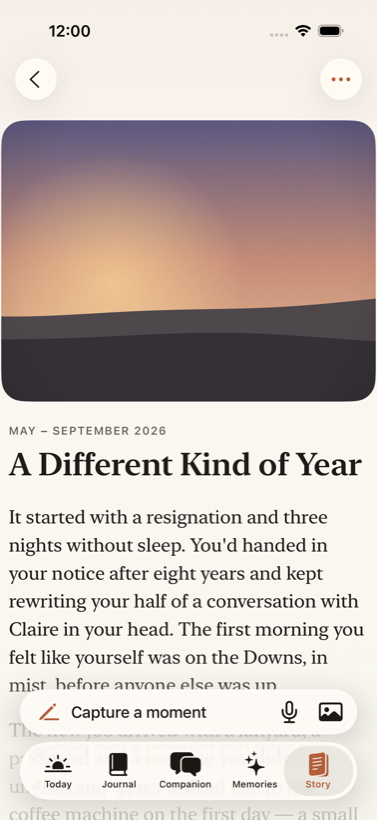
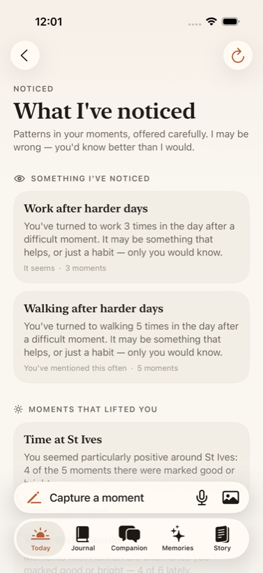

# I&ME

**Capture your life as it happens. Understand yourself over time. Keep the story of you.**

I&ME is a private, local-first life journal with a reflective companion, built as a native iOS app in Swift, SwiftUI and SwiftData. This repository holds the first complete prototype: it compiles, runs in the iOS Simulator, and the whole primary journey works end to end without any network, account or third-party dependency.

| Today | Capture | Journal |
| --- | --- | --- |
|  |  |  |

| A moment | Companion | Memories |
| --- | --- | --- |
|  |  |  |

| Story | A chapter | Noticed |
| --- | --- | --- |
|  |  |  |

## What it does

- **Capture** a moment in seconds: words, a feeling in five plain words, photos from the library or camera, and genuine voice recordings with a live waveform, pause, review and playback. The person never chooses an "entry type"; what they add decides what it is.
- **Journal**: a chronological timeline grouped by month and day, with search and a filter for moments marked worth remembering.
- **Moment**: each entry opens with room to breathe, shows the people, places and themes the app has linked to it, connected moments, and a clear "Talk about this" path into the companion.
- **Companion**: a private conversation grounded in the journal. It classifies what the person says, retrieves the genuinely relevant moments, quotes the person's own words, offers follow-ups, can turn a message into a moment, and says plainly when it has nothing to go on. It runs entirely on the device.
- **Memories**: the meaningful rather than the chronological: kept moments, curated collections, people, places, photos and important days.
- **Story**: editorial chapters drawn from moments ("Who I am now", "A Different Kind of Year", "People who shaped these months") plus a drafting tool that writes a new chapter from any stretch of the person's own entries.
- **Noticed** (insights): observations phrased with honest uncertainty, such as "Walking after harder days", each traceable to the moments behind it and dismissible.
- **You**: name, photo, a few numbers, full transparency over what the app remembers (with "forget"), a privacy explanation, export as readable text or JSON, removal of the sample life, and deletion of everything with double confirmation.
- **Sample life**: onboarding offers a fictional five-month life (52 moments, photos, voice notes, collections, chapters, conversations) so the product's value is visible immediately. It is clearly marked and can be removed at any time.

Everything is local. There is no backend, no account, no analytics, no external AI.

## Requirements

- Xcode 26 (the project targets iOS 26 and uses Swift Testing and the iOS 26 tab bar accessory).
- An iOS 26 simulator, for example iPhone 17 Pro.

## Build and run

Open `IAndMe.xcodeproj` in Xcode, choose an iPhone simulator and press Run. From the command line:

```bash
xcodebuild -project IAndMe.xcodeproj -scheme IAndMe -destination 'platform=iOS Simulator,name=iPhone 17 Pro' build
```

Run every test (unit tests in Swift Testing, UI tests in XCTest):

```bash
xcodebuild -project IAndMe.xcodeproj -scheme IAndMe -destination 'platform=iOS Simulator,name=iPhone 17 Pro' test
```

Useful launch arguments (Edit Scheme → Arguments, or `xcrun simctl launch`):

| Argument | Effect |
| --- | --- |
| `-reset-data` | Deletes the local store and media before launch. |
| `-seed-sample` | Skips onboarding with the sample life installed and the name "Sam". |
| `-open-tab journal` | Opens on a given tab (`today`, `journal`, `companion`, `memories`, `story`). |
| `-capture voice` | Opens the capture sheet at launch in `write`, `voice` or `photo` mode. |
| `-ui-testing` | Removes the companion's thinking delay. |

To run on a physical iPhone, select your development team under Signing & Capabilities; nothing else in the project depends on the simulator.

## Project layout

```
IAndMe/
  App/            Entry point, services container, router, brand constants
  Models/         SwiftData models
  Persistence/    Model container factory, JournalRepository protocol and SwiftData implementation
  Services/       AI (companion), Memory, Insights, LifeStory, Media, Audio, Transcription, Export, Sample
  Features/       One folder per screen area: Onboarding, Main, Today, Capture, Journal, Entry,
                  Companion, Memories, Story, Insights, Profile, Shared
  DesignSystem/   Theme (colours, type, spacing, motion) and reusable components
  Utilities/      Dates, text, on-device language analysis, hashing
  Resources/      Asset catalogue (semantic colours, app icon)
IAndMeTests/      Swift Testing unit tests
IAndMeUITests/    XCTest UI tests for the primary journey
Docs/             Architecture notes and screenshots
```

See [CLAUDE.md](CLAUDE.md) for the full technical overview and [Docs/ARCHITECTURE.md](Docs/ARCHITECTURE.md) for design decisions.

## Name

"I&ME" is a working name. The product name lives in one place (`IAndMe/App/Brand.swift`), the bundle identifier is independent of it, and on-disk storage uses a neutral directory name, so rebranding is a one-file change.
